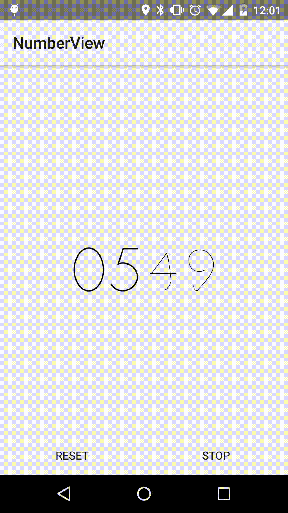

#NumberView

A simple number tweener.



---
###What is it?
NumberView is mean to be a take on [Timely][]'s beautiful and tasteful number tweening animations. Despite looking like it draws actual numbers in it, the numbers drawn are represented as Bèzier curve paths, meticulously calculated with control points and anchors.

---
###Usage
Using [NumberView][] to show a single digit in your project is simple. You can drop it into your XML files as a regular custom view:

Layout file:
```xml
<com.deange.numberview.NumberView
        android:layout_height="wrap_content"
        android:layout_width="wrap_content" />
```

And in your Java file:
```java
final NumberView view = findViewById(...);
view.advance(1);
postDelayed(() -> view.advance(2), 1000);
postDelayed(() -> view.advance(), 2000); // Displays "3"
```

However, typically you'll want to show more than one digit at a time. For that you can use [NumberViewGroup][], which automatically takes care of adding new digits as you need them.

Layout file:
```xml
<com.deange.numberview.NumberViewGroup
        android:layout_height="wrap_content"
        android:layout_width="wrap_content" />

```

And in your Java file:
```java
final NumberViewGroup view = findViewById(...);
view.advance(1);
postDelayed(() -> view.advance(20), 1000);
postDelayed(() -> view.advance(), 2000); // Displays "21"
```

You can always view the sample application code for more usage demos.

---
###Dependencies
No dependencies. Works all the way back to API level 14.

---
###Download

```groovy
repositories {
    maven {
        url "https://jitpack.io"
    }
}

dependencies {
    compile 'com.github.cdeange:NumberView:1.1.0'
}
```

---
###Developed By
- Christian De Angelis - <de@ngelis.com>

---
###License

```
Copyright 2016 Christian De Angelis

Licensed under the Apache License, Version 2.0 (the "License");
you may not use this file except in compliance with the License.
You may obtain a copy of the License at

   http://www.apache.org/licenses/LICENSE-2.0

Unless required by applicable law or agreed to in writing, software
distributed under the License is distributed on an "AS IS" BASIS,
WITHOUT WARRANTIES OR CONDITIONS OF ANY KIND, either express or implied.
See the License for the specific language governing permissions and
limitations under the License.
```


[Timely]: https://play.google.com/store/apps/details?id=ch.bitspin.timely
[NumberView]: https://github.com/cdeange/NumberView/blob/master/library/src/main/java/com/deange/numberview/NumberView.java
[NumberViewGroup]: https://github.com/cdeange/NumberView/blob/master/library/src/main/java/com/deange/numberview/NumberViewGroup.java
